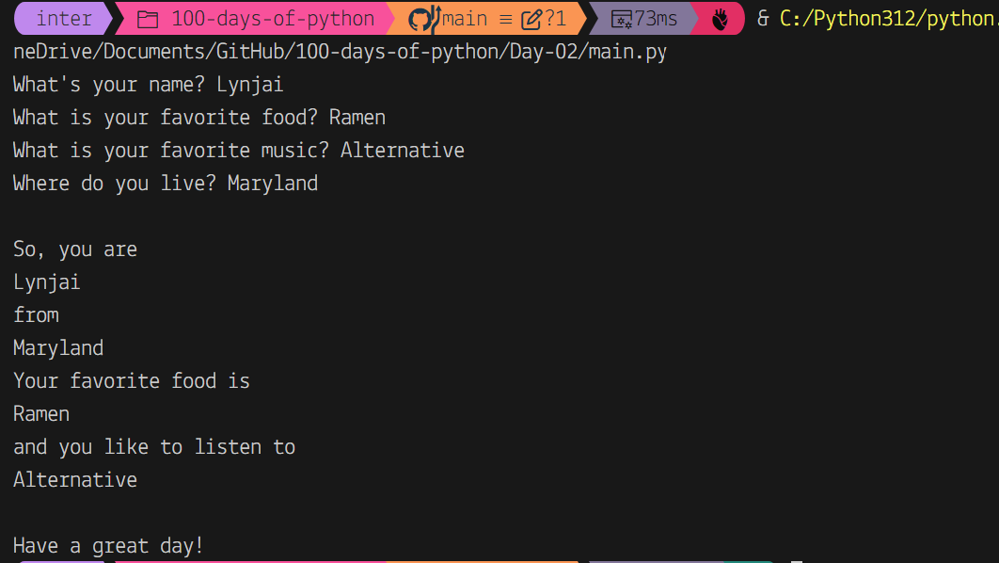

Sure! Here's your content converted to a GitHub README format:

```markdown
# Taking User Input

## Input

Let's take a look at the input command and how that works. Input is when the user gives information to the computer.

It's very similar to the print command, except that it'll show the message in the console then wait until the user has typed something into the console and pressed enter. Let's try it!

👉 Copy this code into your coding editor in `main.py` and see what happens when you hit run:

```python
input("What's your name?: ")
```

## Variables

### What is a variable?

`input` asks for something, takes it, but then has nowhere to put it. We can change that with a variable which is a value that we can use to name and store data. (Remember, David's box for David's phone?)

### Naming variables

You can give a variable any name you want, but you can't use spaces. You can use:
- `underscores_between_words`
- `camelCaseToMakeItEasierToRead`

👉 Delete all your code and copy this into your code editor in the `main.py` file:

```python
myName = input("What's your name? ")
myAge = input("How old are you? ")
print("Gee, that's REALLY OLD")
replit = input("Do you like Replit? ")
print("OF COURSE YOU DO!")
```

We now have three variables:
- `myName` has the user's name in it
- `myAge` is storing their age
- `replit` is storing their feelings about this amazing website.

### Printing a Variable

You can print your variable using `print` and the name you used for your variable in your input command. Remember the three variables we just created: `myName`, `myAge`, and `replit`?

In your code you can now print 'name' by using `print(myName)` or 'age' by using `print(myAge)`.

👉 Let's try it! Try adding this code to the end of what you've got and hit run:

```python
print()
print("So, you are")
print(myName)
print("and are the ripe old age of")
print(myAge)
print("and clearly think that Replit is")
print(replit)
```

Did you notice what `print()` did?
- if there is text inside `()`, the text is printed
- if there is nothing inside the `()`, then a blank line is added for a bit of space

This code looks a little funky at the moment. We will make this look better tomorrow.

## Common Errors

First, delete any other code in your `main.py` file. Copy each code snippet below into `main.py` by clicking the copy icon in the top right of each code box. Then, hit run and see what errors occur. Fix the errors and press run again until you are error-free. Click on the 👀 Answer to compare your code to the correct code.

### Syntax Error

👉 What is wrong with the code below? Copy the code only (not the error message) and hit run.

```python
my variable = input("WHO GOES THERE? ")
print(my variable)
```

Did you get this error message? What can you fix?

```plaintext
  File "main.py", line 1
    my variable = input("WHO GOES THERE? ")
       ^
SyntaxError: invalid syntax
```

Did you notice the space in the variable name? We never put spaces in variable names - it just confuses the poor computer!

### Name Error

👉 What is wrong with this code? Copy only the code and press run.

```python
myGrandma = input("How's your Grandma doing? 😘 ")
print(mygrandma)
```

Did you get this error message? How can you fix it?

```plaintext
How's your Grandma doing? 😘 fine
Traceback (most recent call last):
  File "main.py", line 2, in <module>
    print(mygrandma)
NameError: name 'mygrandma' is not defined
```

What we're trying to print out is NOT the same as what we set the variable up as in the first place. The capitalization is different. `myGrandma` versus `mygrandma`.

This is also important when you try to print out a variable that you haven't created yet. You must ALWAYS create the variable BEFORE you print it out.

### This is just plain weird...

You won't get an error from this one, but the output won't make a lot of sense...

👉 Copy this code and run it to see what happens.

```python
myLunch = input("What are you having for lunch? ")
print("Hmm, it sounds like you really should just order")
print("myLunch")
print("as soon as possible!")
```

```plaintext
What are you having for lunch? Burrito
Hmm, it sounds like you really should just order
myLunch
as soon as possible!
```

You've tried to print a variable, but added in quotes!
Remember: quotes will literally print out whatever you stick in them.
In this case, it's printing the variable name instead of the contents of the variable.
If you want the contents, then you DO NOT USE QUOTES.

## Fix My Code

👉 Try and fix this code which is full of errors.

First, delete any other code in your `main.py` file. Copy each code snippet below into `main.py` by clicking the copy icon in the top right of each code box. Then, hit run and see what errors occur. Fix the errors and press run again until you are error-free. Click on the 👀 Answer to compare your code to the correct code.

Please note: This is a silly example. You'd never write your own Phishing code, but it's really important to know what to look for. If someone's asking you for this kind of information online - think twice!

```python
print("Definitely not a Phishing Scam")
print()
input("Your Name")
print("Thanks for logging in")
print(myName)
cardNumber = input("What is your credit card number?")
print("Thanks, I definitely wont put")
print("cardNumber")
print("into Amazon and order anything weird")
print()
print("Promise")
maidenName input("What is your Mother's maiden name? ")
print()
print("That's cool, I just wanted to know that")
print(maidenName)
print("was your Mum's maiden name. Not because the bank requested it or anything, honest.")
print("Definitely not a Phishing Scam")
print()
myName = input("What is your name?")
print("Thanks for logging in")
print(myName)
cardNumber = input("What is your credit card number?")
print("Thanks, I definitely won't put")
print(cardNumber)
print("into Amazon and order anything weird")
print()
print("Promise")
maidenName = input("What is your Mother's maiden name? ")
print()
print("That's cool, I just wanted to know that")
print(maidenName)
print("was your Mum's maiden name. Not because the bank requested it or anything, honest.")
```

## 👉 Day 2 Challenge: Getting to Know You Project

You can continue to use this same repl for your project. Just make sure you delete any previous code from our practice session.

Write code that does the following:
1. Asks for the user's name, favorite food, favorite music, and where they live (or you can create other questions!)
   - Think about what needs to be a print statement and what needs to be an input statement.
2. Store all of the answers in different variables.
   - Create a different input statement for each variable.
3. Print out a full sentence that includes the user's favorite things.
   - Remember, you have to create the variable with input before you can print.
4. Give them a positive affirmation at the end - tell them they rock at doing something!

### Example (go to the end for the solution...but no peeking):

```plaintext
Getting to know you!
You are
Mark
You're probably hungry for
Burritos
and you're definitely getting your groove on to
Synthwave and Anything by our man Rick Astley
living in the amazing
Edge of reality
```

### My Solution:

