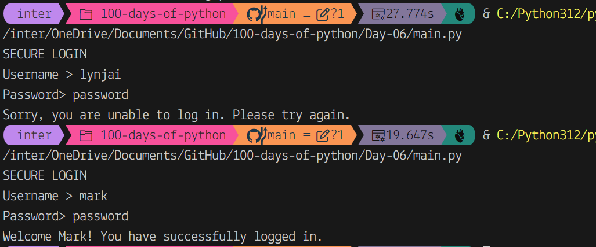

# What the elif is this?

The `elif` command (which stands for 'elseif') allows you to ask 2, 3, 4 or 142 questions using the same input! This command must be in a certain place. You can have as many `elif` statements as you want, but they must go in between `if` and `else` and have the same indentation. The print statements in your `elif` command need to line up with the indent of the other print statements.

## Example

Where would an `elif` statement go in the code below?

```python
print("SECURE LOGIN")
username = input("Username > ")
if username == "mark":
  print("Welcome Mark!")
else:
  print("Go away!")
```

👉 Add this `elif` statement to the code above. Make sure you indent properly AND put it in between the `if` and `else` statements!

```python
elif username == "suzanne":
  print("Hey there Suzanne!")
```

Your code should look like this:

```python
print("SECURE LOGIN")
username = input("Username > ")
if username == "mark":
  print("Welcome Mark!")
elif username == "suzanne":
  print("Hey there Suzanne!")
else:
  print("Go away!")
```

How easy was that? You will be a pro in no time!

## Add a password

Let's add a bit more input.
👉 Now that we have input for both a username and password, we need to change our `if` and `elif` statements just a bit so both the username and password must match for Mark and Suzanne to login.

```python
print("SECURE LOGIN")
username = input("Username > ")
password = input("Password> ")
```

👉 In the code below the username and password must both be correct for Mark to login.

```python
print("SECURE LOGIN")
username = input("Username > ")
password = input("Password> ")
if username == "mark" and password == "password":
 print("Welcome Mark!")
elif username == "suzanne":
 print("Hey there Suzanne!")
else:
 print("Go away!")
```

👉 Suzanne's password is 'Su74nne'. Can you add that to the code above? (HINT: It should be very similar to Mark.)

```python
print("SECURE LOGIN")
username = input("Username > ")
password = input("Password> ")
if username == "mark" and password == "password":
 print("Welcome Mark!")
elif username == "suzanne" and password == "Su74nne":
 print("Hey there Suzanne!")
else:
 print("Go away!")
```

## Common Errors

First, delete any other code in your `main.py` file. Copy each code snippet below into `main.py` by clicking the copy icon in the top right of each code box. Then, hit run and see what errors occur. Fix the errors and press run again until you are error-free. Click on the 👀 Answer to compare your code to the correct code.

### Syntax Error

👉 What is wrong with the code below?

```python
print("SECURE LOGIN")
username = input("Username > ")
if username == "mark":
  print("Welcome Mark!")
else:
  print("Go away!")
elif username == "suzanne":
  print("Hey there Suzanne!")
```

You are getting really good at this!

### Fix My Code

👉 Try and fix this code which is full of errors.

First, delete any other code in your `main.py` file. Copy each code snippet below into `main.py` by clicking the copy icon in the top right of each code box. Then, hit run and see what errors occur. Fix the errors and press run again until you are error-free. Click on the 👀 Answer to compare your code to the correct code.

```python
season = input(what is your favorite season?)
if season = "spring"
  print("Ah! The birds are chirping and flowers blooming.")
  elif season == summer:
  print("Catch some sun and cool off with a lemonade.")
elif season == autumn
print("The leaves are changing and the air is crisp. Enjoy!)
      elif season = winter:
      print("Stay warm by the fire and watch the snow fall.")
else: 
print("I don't know that season. Please try again.")
```

Corrected code:
```python
season = input("What is your favorite season?")
if season == "spring":
  print("Ah! The birds are chirping and flowers blooming.")
elif season == "summer":
  print("Catch some sun and cool off with a lemonade.")
elif season == "autumn":
  print("The leaves are changing and the air is crisp. Enjoy!")
elif season == "winter":
  print("Stay warm by the fire and watch the snow fall.")
else: 
  print("I don't know that season. Please try again.")
```

## 👉 Day 6 Challenge: Make your own login program.

Create a program where someone logins with their username and password correctly and then gets a lovely individual greeting.
- Write a specific personalized greeting for 3 different people.
- Don't forget an `else` statement for everyone else who shouldn't be logging in.

### Example

```plaintext
Marvel Movie Character Creator
--
Do you like 'hanging around'?: No
Then you're not Spider-man
Do you have a 'gravelly' voice?: No
Aww, then you're not Korg
Do you often feel 'Marvelous'?: Yes
Aha! You're Captain Marvel! Hi!
```

### My Solution:


