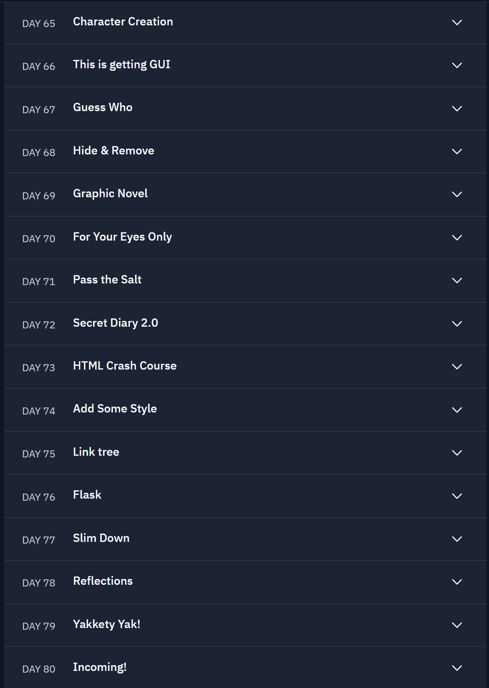

# 100 Days of Code - The Complete Python Course

In this course, you will build games, apps, and websites by mastering Python programming. Start the course to build 100 projects in 100 days.

## What you'll learn

### Programming 101
Build a solid foundation and learn about the building blocks of modern technology.

### Python
Become a master of one of the most popular and in-demand coding languages. [Learn more about Python](#)

### How to build things
Jump right into building fun and useful projects. Build a strong portfolio of work that you’re proud of!

## Course preview

